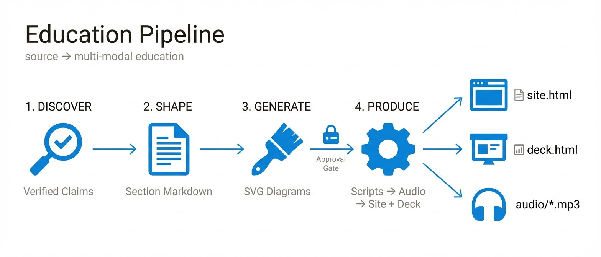

# amplifier-bundle-education

A reusable Amplifier bundle that turns source content into a complete multi-modal education product: a reading site, a presentation deck, chapter-by-chapter audio narration, and code-drawn diagrams — all from a single source of truth.

<p align="center">
  
</p>

---

## What It Does

Point this bundle at a repository or document and it produces:

- **A reading site** (`{slug}-site.html`) — standalone HTML with sidebar TOC, interactive diagrams, presentation mode, and per-chapter audio player
- **A presentation deck** (`{slug}-deck.html`) — standalone HTML with arrow-key navigation, speaker notes, and slide overview
- **Audio narration** (`audio/*.txt` + `audio/*.mp3`) — lecture-style voiceover adapted for listening, synthesized via OpenAI TTS
- **Reference document** (`{slug}.md`) — verbose markdown with full educational content, AI-consumable with rich frontmatter
- **Print-ready PDF** (`{slug}.pdf`) — professional typeset document via WeasyPrint, textbook quality
- **Visual assets** (`public/diagrams/*.svg`) — code-drawn SVG diagrams built from an art-directed concept

Output filenames use a slug derived from `subject_name` (e.g. `"Design Intelligence for Amplifier"` → `design-intelligence-for-amplifier-site.html`). Multiple editions can coexist in the same directory.

The pipeline runs with one command. It pauses for human review at the visual art direction gate, and optionally at two additional gates during deliverable production (narration review and site design review).

---

## Quickstart

Install the bundle:

```bash
amplifier bundle add git+https://github.com/your-org/amplifier-bundle-education@main
amplifier bundle use education
```

Or add to your project's `bundle.md`:

```yaml
includes:
  - bundle: git+https://github.com/your-org/amplifier-bundle-education@main
```

Then run in a session:

```bash
# Full pipeline (one-shot)
amplifier run "execute education:recipes/full-edition.yaml with source_repo=/path/to/your/repo and subject_name='Your Subject Name'"

# Or interactive chat
amplifier
> execute the full-edition recipe with source_repo=/path/to/repo and subject_name="Your Subject Name"

# Deep discovery for complex repos
> execute education:recipes/full-edition.yaml with source_repo=/path/to/repo and subject_name="Complex System" and discovery_depth=deep

# Rebuild deliverables only (if you edited sections)
> execute education:recipes/produce-deliverables.yaml

# Interactive mode with review gates
> execute education:recipes/produce-deliverables-interactive.yaml

# Use agents directly
> Delegate to education:content-strategist to analyze the reconciliation
> Use the site-builder to rebuild the reading site
```

---

## Prerequisites

**Required for all deliverables:**
- [Amplifier](https://github.com/microsoft/amplifier) installed and configured
- **An LLM provider** — at least one API key configured (Anthropic, OpenAI, or Google). Every pipeline step uses an LLM.
- **`GOOGLE_API_KEY`** — required for concept image generation in Phase 3 (nano-banana uses Gemini)

**Required for audio production (MP3 synthesis):**
- **`OPENAI_API_KEY`** — required for TTS synthesis (and also works as your LLM provider)
- **ffmpeg** — `brew install ffmpeg` (macOS) or `apt install ffmpeg` (Linux)
- **openai Python package** — `pip install openai` or `uv add openai`

**Required for PDF generation:**
- **weasyprint** Python package — `pip install weasyprint` or `uv add weasyprint`

**Optional:**
- **`design-intelligence-enhanced` bundle** — used by the interactive recipe's design review gate. Not required for the flat/autonomous pipeline.

Set `produce_audio: false` in the recipe context to skip narration and TTS entirely.

---

## Features

- **Two-tier discovery** — quick mode (default) does a single-pass structured reading at ~1× repo token cost. Deep mode (opt-in) runs full Parallax Discovery with 3 independent passes for complex repos. Both produce a verified knowledge base with file:line evidence.
- **Inductive content structure** — the content-strategist enforces concrete-first, principle-second structure across all sections. No AI-default deductive writing.
- **Concept-first visual workflow** — generate visual targets with nano-banana, approve the art direction, then build production SVGs. Human judgment at every visual gate.
- **Four deliverables, one source** — site, deck, audio, and diagrams are all generated from the same section markdown files. Edit a section, rebuild all four.
- **TTS audio synthesis** — narration scripts are synthesized to MP3 via OpenAI TTS, with smart chunking, incremental builds, and ffmpeg concatenation.
- **Interactive or autonomous** — review deliverables as they're built (interactive recipe with two approval gates), or let the pipeline run straight through (flat recipe called by full-edition).
- **Design-intelligence review** — the interactive recipe runs a design-check agent on the built site, reporting token compliance, accessibility, and audio player integration before you approve.
- **Edition management** — hash-based change detection identifies the minimum rebuild when source content changes. One command to update.
- **Paper Frame aesthetic (default)** — editorial white-card-on-warm-canvas design system. Customizable via design-system.md and AESTHETIC-GUIDE.md.

---

## Pipeline

```
Source repo
    │
    ▼ discover-quick.yaml (default) or discover-deep.yaml (opt-in)
Structured reading (or Parallax 3-pass) → reconciliation.md
    │
    ▼ shape-content.yaml
Content strategy → Section markdown files
    │
    ▼ generate-assets.yaml (STAGED — art direction approval gate)
Concept images → Art direction approval → Production SVGs
    │
    ▼ produce-deliverables.yaml (or produce-deliverables-interactive.yaml)
audio/*.txt → audio/*.mp3 → {slug}-site.html (with audio player) → {slug}-deck.html → {slug}.md → {slug}.pdf
                                │
                          [interactive only]
                          Gate 1: review scripts before TTS
                          Gate 2: design review before deck
```

---

## Two Modes for Deliverable Production

| Recipe | Mode | Gates | Use when |
|--------|------|-------|----------|
| `produce-deliverables.yaml` | Autonomous | None | Full-edition pipeline, rebuilds, CI |
| `produce-deliverables-interactive.yaml` | Interactive | 2 | First run, reviewing voice/design, expensive TTS |

**Gate 1 — After narration scripts, before TTS:** Shows word counts, estimated duration, and estimated cost. Review `audio/*.txt` before spending on synthesis.

**Gate 2 — After site build, before deck:** A design-intelligence agent reviews `site.html` against Paper Frame tokens, typography, layout, audio player contract, and accessibility. Your approval feedback is passed to the deck builder.

The flat version is what `full-edition.yaml` calls. The interactive version is invoked directly when you want control.

---

## Agents

| Agent | Role |
|-------|------|
| `content-strategist` | Voice, tone, depth calibration, section outline |
| `section-author` | Section markdown + HTML site assembly |
| `visual-director` | Art direction, concept generation, aesthetic guide |
| `asset-builder` | Production SVG diagrams |
| `deck-composer` | Presentation slides + speaker notes |
| `narration-adapter` | Voiceover scripts (adapted for listening) |
| `document-compiler` | Verbose markdown reference + print-ready HTML/PDF |
| `edition-manager` | Change detection, update planning, edition bookkeeping |

---

## Recipes

| Recipe | Phase | Type | Description |
|--------|-------|------|-------------|
| `full-edition.yaml` | All | Flat | Master pipeline: discovery → content → assets → deliverables |
| `discover-quick.yaml` | 1 | Flat | Single-pass structured reading (default, ~1× token cost) |
| `discover-deep.yaml` | 1 | Flat | Full Parallax 3-pass discovery (opt-in, ~3-5× token cost) |
| `shape-content.yaml` | 2 | Flat | Content strategy + section authoring |
| `generate-assets.yaml` | 3 | Staged | Concept images → approval gate → production SVGs |
| `produce-deliverables.yaml` | 4 | Flat | Scripts → TTS → site → deck → verify (autonomous) |
| `produce-deliverables-interactive.yaml` | 4 | Staged | Same steps, two review gates (narration + design) |
| `synthesize-audio.yaml` | 4 (sub) | Flat | TTS synthesis: .txt → .mp3 via OpenAI |
| `update-edition.yaml` | — | Staged | Detect changes → approval gate → minimum rebuild |

---

## Built From

This bundle was extracted and generalized from the `amplifier-masterclass` project — a fully produced education product for the Amplifier framework that includes a 5,400-line standalone site, 16-slide presentation, 13 chapter narrations, and 9 code-drawn SVG diagrams.

All patterns in this bundle were validated against that production run.

---

## Documentation

See [docs/GUIDE.md](docs/GUIDE.md) for the full user guide, including:
- Complete pipeline walkthrough
- Interactive vs autonomous mode comparison
- Art direction workflow
- Audio player contract and TTS configuration
- Edition update workflow
- Content model reference
- Agent reference with delegation examples
- Troubleshooting

---

## License

MIT
